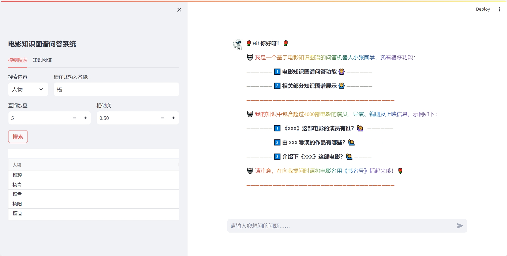
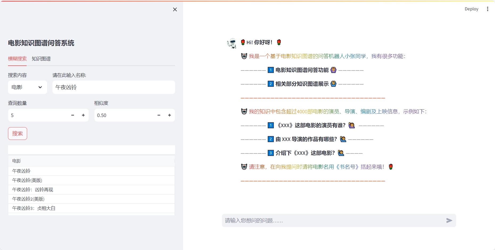
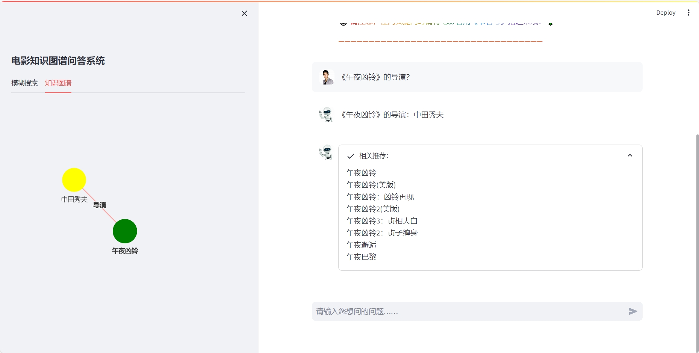
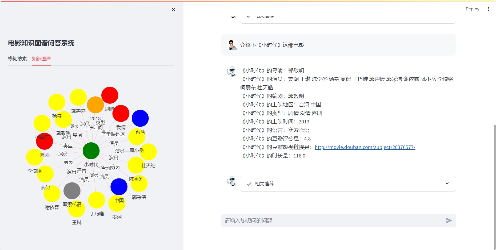
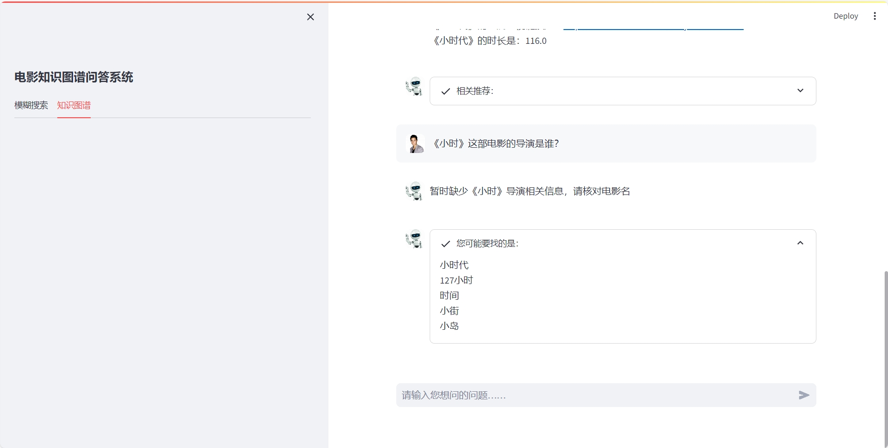

# 基于streamlit+neo4j构建的简易知识图谱问答系统
作者

①张涵钧  *天津科技大学*

②高孟绅  *辽宁石油化工大学*

③赵晓娣  *天津科技大学*


*欢迎您的访问!*

*本项目是一个简易的功能实现，很多问题需要重新设计并更改，希望得到您的帮助。*

*欢迎向我们提出您的建议或问题，我们将每月集中制定计划并修改。*

## 1.演示

我们使用streamlit作为前端开发工具，使用neo4j作为图数据库进行存储知识图谱。

初始页面：

我们设计了一个比较实用的问答界面，借助了streamlit-chatbox工具实现了人机交互界面


搜索演示：

人物模糊搜索，该功能设计的目的是希望通过搜索的方式让用户可以在此找到正确的电影名及人名





问答演示：

我们在问答过程中添加了部分知识图谱展示功能，知识图谱部分基于streamlit-agraph来实现的，同时实现了<相关推荐>及<可能要问的是>两个功能，其原理同搜索功能。








## 2.运行
### 2.1 数据集及运行环境
数据集来源于：http://www.openkg.cn/dataset/douban-movie-kg

该数据集是一个豆瓣电影数据集，包括电影、导演、演员、编剧、上映信息、网址链接等信息。

运行需要的环境：

    jieba==0.42.1
	pandas
	numpy
	streamlit==1.30.0
	streamlit-aggrid
	streamlit-agraph
	streamlit-chatbox
	py2neo==2021.2.4
 	python==3.8.12
	pandas==1.3.5
	neo4j==5.16.0

 所有安装包直接pip install 即可
### 2.2 知识图谱构建

jupyter运行data_to_csv.ipynb

得到相应的实体列表、属性及关系三元组

jupyter运行create_kg.ipynb,运行前需要将你的neo4j的链接和用户信息添加到下面。

    uri = ""
	username = ""
 	password = ""

构建相应的知识图谱以三元组形式存储至neo4j。由于我们主要是做基于图谱的问答，所以在数据集和图谱的制作上使用了jupyter，后续我们会将该部分写成类的形式到.py文件

### 2.3 问答系统界面启动

运行前需要修改answer.py中的neo4j链接和信息

    uri = ""
	username = ""
 	password = ""

启动chat_ui.py开启streamlit。端口号默认：localhost:8501

运行以下命令：

```python  
>> cd Path to folder
>> streamlit run chat_ui.py [ARGUMENTS]
```
## 3.问题类型

| 问题 | 问法 |
| --- | --- |
| 问导演 | 《xxx》的导演？/xxx导演过哪些作品？ |
| 问演员 | 《xxx》的演员？/xxx出演过哪些作品？ |
| 问编剧 | 《xxx》的编剧？/xxx编剧过哪些作品？ |
| 问语言 | 《xxx》的播放语言/语种 |
| 问地区 | 《xxx》的上映地区？ |
| 问时间 | 《xxx》的上映时间？ |
| 问类型 | 《xxx》是什么类型？ |
| 问时长 | 《xxx》的时长？ |
| 问评分 | 《xxx》的豆瓣评分？ |
| 问链接 | 《xxx》的豆瓣链接？ |
| 问介绍 | 介绍下《xxx》？ |


## 4.致谢

该项目在短短的几天晚上就基本顺利完成了，感谢高孟绅同学及赵晓娣同学的付出及参与，顺利地完成了最初版本。希望年后我们可以利用深度学习的知识来进行意图识别及实体识别部分，以更精准的方式呈现。
